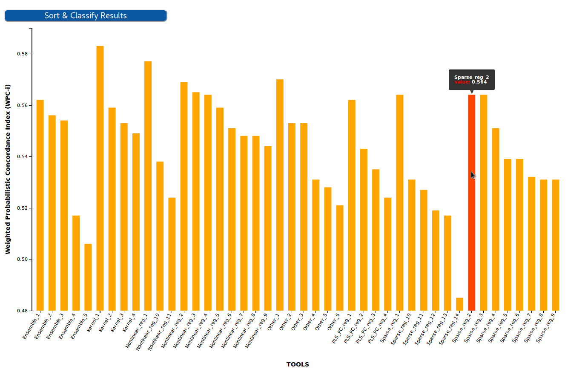
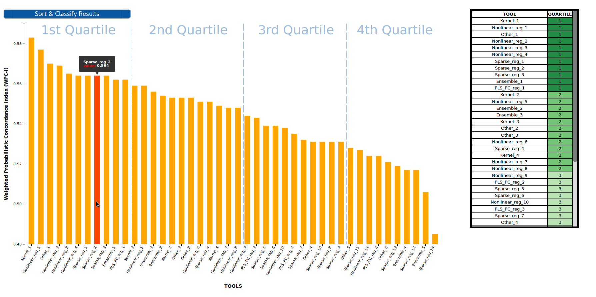

# Benchmarking Results Visualizer - Barplot

This [D3 graph](https://d3js.org/) is used to visualize the results of a benchmarking challenge that uses one single evaluation metric in the form of a Barplot. Challenge participants are shown in the X axis, while the value of their metric is shown in the Y axis.



## Input
The visualizer uses as input the results of one challenge stored in the OpenEBench database in the format of the official [Benchmarking Data Model](https://github.com/inab/benchmarking-data-model). [OpenEBench Scientific API](https://openebench.bsc.es/sciapi/) is used to access the database by using the following query:
```
getDatasets(datasetFilters:{challenge_id: $challenge_id, type:"assessment"}) {
                            _id
                            community_ids
                            datalink{
                                inline_data
                            }
                            depends_on{
                                tool_id
                                metrics_id
                            }
                        }
```

## Classification
As other [OpenEBench results visualizers](https://github.com/inab/OpenEBench_scientific_visualizer), this plot format results can be transfomed to tabular format by sorting the participants in descending/ascending order according to their metrics and applying a quartile classification over that lineal set of values. This classifcation splits the participants in four different groups/clusters depending on their performance. Clusters are separated in the plot with vertical lines and showed in the right table together with a green color-scale, which is easier to interpret for both experts and non-experts users.

